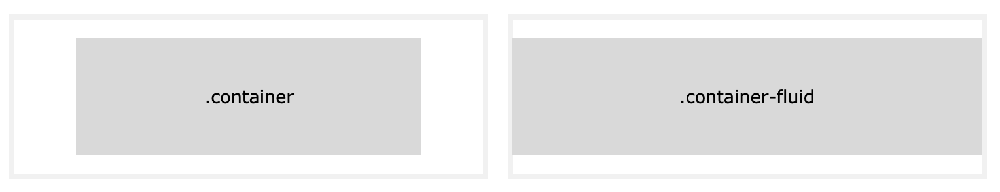
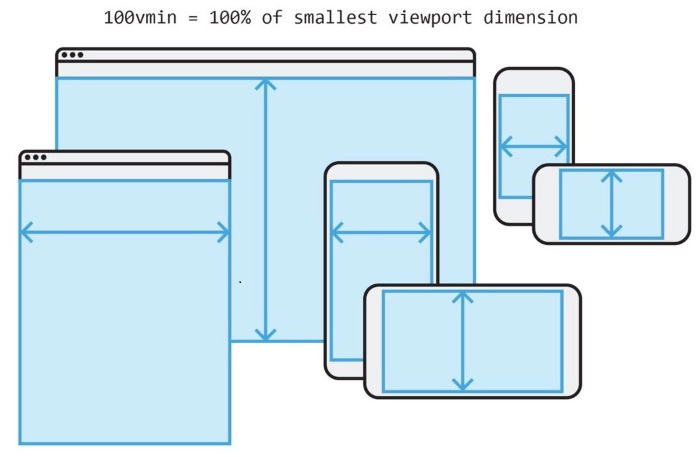

# v001 bootstrap study

[TOC]


## 기초

- Twitter에서 개발한 UI 라이브러리

- 공식사이트 https://getbootstrap.com

- bootstrap script
  
  - integrity 와 crossorigin 옵션 : 자바스크립트를 사용한 보안 공격 방어

  - Bootstrap css 와 javascript
  
    - bootstrap.css
    - jquery.js
    - popper.js    
    - bootstrap.js
  
    ```html
    <head>
        
    <!-- Bootstrap CSS -->
    <link rel="stylesheet" href="https://stackpath.bootstrapcdn.com/bootstrap/4.3.1/css/bootstrap.min.css" integrity="sha384-ggOyR0iXCbMQv3Xipma34MD+dH/1fQ784/j6cY/iJTQUOhcWr7x9JvoRxT2MZw1T" crossorigin="anonymous">
        
    <!-- Optional JavaScript -->
    <!-- jQuery first, then Popper.js, then Bootstrap JS -->
    <script src="https://code.jquery.com/jquery-3.3.1.slim.min.js" integrity="sha384-q8i/X+965DzO0rT7abK41JStQIAqVgRVzpbzo5smXKp4YfRvH+8abtTE1Pi6jizo" crossorigin="anonymous"></script>
    <script src="https://cdnjs.cloudflare.com/ajax/libs/popper.js/1.14.7/umd/popper.min.js" integrity="sha384-UO2eT0CpHqdSJQ6hJty5KVphtPhzWj9WO1clHTMGa3JDZwrnQq4sF86dIHNDz0W1" crossorigin="anonymous"></script>
    <script src="https://stackpath.bootstrapcdn.com/bootstrap/4.3.1/js/bootstrap.min.js" integrity="sha384-JjSmVgyd0p3pXB1rRibZUAYoIIy6OrQ6VrjIEaFf/nJGzIxFDsf4x0xIM+B07jRM" crossorigin="anonymous"></script>
        
    </head>
    ```
  
  

## 주의 사항

##### box-sizing

박스 요소의 일관된 사이즈 계산을 위해 box-sizing 속성을 border-box로 변경해 사용한다.
이는 일부 서드파티 라이브러리(Google Maps, Google Custom Search Engin 등)에 영향을 미칠수 있다고 함.
이경우 필요한 클래스들에 대해 box-sizing 을 content-box 로 오버라이딩해서 사용해야 함.

```css
# selector-for-some-widget 클래스에 대해 box-sizing 을 content-box 로 재정의 
.selector-for-some-widget {
  box-sizing: content-box;
}
```

기타 속성 재정의는 https://getbootstrap.com/docs/4.3/content/reboot/ 참조

#### 

## bootstrap 사용법

- bootstrap css 적용만으로 기본적으로 html 태그 속성들이 bootstrap에 맞게 초기화되어 조금 다르게 보여진다.

- bootstrap을 이용해 웹페이지를 만드는 것은 bootstrap에서 정의된 다양한 클래스(컴포넌트)들을 적용하고, 부가적인 속성이나 레이아웃 관련 속성들을 정의한 클래스들을 조합해 나가는 과정이다.

  ```html
  <button type="button" class="btn">Basic</button>
  <button type="button" class="btn btn-primary">Primary</button>
  <button type="button" class="btn btn-secondary">Secondary</button>
  <button type="button" class="btn btn-success">Success</button>
  <button type="button" class="btn btn-info">Info</button>
  <button type="button" class="btn btn-warning">Warning</button>
  <button type="button" class="btn btn-danger">Danger</button>
  <button type="button" class="btn btn-dark">Dark</button>
  <button type="button" class="btn btn-light">Light</button>
  <button type="button" class="btn btn-link">Link</button>
  ```

  [example]: ./example_btn.md	"example_btn.md"

  

## bootstrap 구조

### 컨테이너(Container)

- 화면 구성 요소들을 묶이 위한 틀로써, 일반적으로 <div> 태그들을 중첩해 사용한다.
- bootstrap에서는 전체 구조를 잡기 위해 conatiner 와 container-fluid 클래스를 사용한다.

#### container

- 반응형으로 동작하며, 고정폭을 가진다.
- width 설정과 margin 설정을 통해  container와  브라우저 윈도우 사이에 여백을 조정할 수 있다.

#### container-fluid

- viewport 전체 폭을 모두 차지하는 컨테이너 박스이다.


- container / container-fluid class

-  viewport  
  

### 그리드(Grid)

- 테이블처럼 화면을 분할하여 원하는 layout을 구성하기 위해 사용한다.
- 12개의 컬럼 구조를 사용할 수 있다.
- 5개의 화면 크기와 관련된 옵션을 제공한다.

```
bootstrap의 Grid는 flexbox(Flexible Box Layout Module)에 기반하며, float, display, position 등의 속성을 이용해서 컨테이너 안에서 박스를 일관된 방식으로 배치하게 된다.
```

##### Grid Column


##### Grid 옵션

- Grid 컨터이너 폭을 사용할때 px를 사용한다 (bootstrap은 기본적으로 em, rem 단위를 사용)

- Grid 시스템은 화면크기에 따라 사용가능한 5개의 class를 옵션으로 제공한다.

  ```css
  .col-    (extra small devices - 화면크기 < 576px)
  .col-sm- (small devices - 화면크기 ≥ 576px)
  .col-md- (medium devices - 화면크기 ≥ 768px)
  .col-lg- (large devices - 화면크기 ≥ 992px)
  .col-xl- (xlarge devices - 화면크기 ≥ 1200px)
  ```

  ```css
  .col-sm-1 		# sm 사이즈의 1컬럼 크기
  .col-md-2 		# md 사이즈의 2컬럼 크기
  ```

  ex) 화면크기에 따라 비율은 조정되나 배치는 바뀌지 않음

  ```css
  <div class="row">
      <div class="col">.col</div>
      <div class="col">.col</div>
      <div class="col">.col</div>
  </div>
  ```

  [example]: ./example_grid_col.md	"ctrl + mouse click"

  ex) 화면크기가 576px 보다 작아지만 배치가 상하로 변경됨

  ```css
  <div class="row">
      <div class="col-sm-3">.col-sm-3</div>
      <div class="col-sm-3">.col-sm-3</div>
      <div class="col-sm-3">.col-sm-3</div>
      <div class="col-sm-3">.col-sm-3</div>
  </div>
  ```

  [example]: ./example_grid_colsm3.md	"ctrl + mouse click"

  ex) .w-100 클래스를 사용하여 줄바꿈

  ```css
  <div class="row">
      <div class="col-sm-3">.col-sm-3</div>
      <div class="col-sm-3">.col-sm-3</div>
      <div class="w-100"></div>
      <div class="col-sm-3">.col-sm-3</div>
      <div class="col-sm-3">.col-sm-3</div>
  </div>
  ```

  [example]: ./example_grid_colsm3_newline.md	"ctrl + mouse click"


### 컴포넌트(Component)

- component는 boostrap 에서 정의한 UI 요소이다.

- 버튼, 경고창, 네이게이션바와 같이 화면 구성에 필요한 요소들을 정의한 클래스 집합이다.

- component 유형

  - 클래스만으로 동작하는 유형
  - 특정 태그와 함께 사용하는 유형

- [component 사용예]: https://getbootstrap.com/docs/4.3/components/alerts/	"ctrl + mouse click"

##### component 사용법

- 클래스만으로 동작하는 유형의 컴포넌트

  ```
  <span class="badge badge-secondary">New Item</span>
  ```

  

  ex) badge badge-secondary 클래스 example

  ```html
  <h1><span class="badge badge-secondary">New Item</span></h1>
  ```

  ```html
  <h1>Example heading <span class="badge badge-secondary">New</span></h1>
  <h2>Example heading <span class="badge badge-secondary">New</span></h2>
  <h3>Example heading <span class="badge badge-secondary">New</span></h3>
  <h4>Example heading <span class="badge badge-secondary">New</span></h4>
  <h5>Example heading <span class="badge badge-secondary">New</span></h5>
  <h6>Example heading <span class="badge badge-secondary">New</span></h6>
  ```

  

- 특정 태그와 함께 사용하는 유형

  ```html
  <button type="button" class="btn btn-primary">
  </button>
  ```


  ex) button tag 와 함께 사용하는  btn btn-primary 클래스 예제

  ```html
  <button type="button" class="btn btn-primary">
    New Item <span class="badge badge-light">4</span>
  </button>
  ```

[example]: ./example_component.md	"ctrl + mouse click"


### 유틸리티 

- 별도의 CSS 속성 정의 없이 사용하는 매크로와 같은 유틸리티 클래스들이 있다.

- component들과 결합해서 사용한다.

- 종류

  - margin, padding, color, position, size 등, 다양한 CSS가 미리 정의된 유틸리티를 지원한다.

- [유틸리티 사용예]: https://getbootstrap.com/docs/4.3/utilities/	"ctrl + mouse click"

##### color

- primary, secondary, success, danger, warning, info, light, dark, white 와 같은 스키마로 정의되어 있으며
  배경, 텍스트, 버튼 등에 결합되어 사용된다.

```html
<div class="p-3 mb-2 bg-primary text-white">.bg-primary</div>
<div class="p-3 mb-2 bg-secondary text-white">.bg-secondary</div>
<div class="p-3 mb-2 bg-success text-white">.bg-success</div>
<div class="p-3 mb-2 bg-danger text-white">.bg-danger</div>
<div class="p-3 mb-2 bg-warning text-dark">.bg-warning</div>
<div class="p-3 mb-2 bg-info text-white">.bg-info</div>
<div class="p-3 mb-2 bg-light text-dark">.bg-light</div>
<div class="p-3 mb-2 bg-dark text-white">.bg-dark</div>
<div class="p-3 mb-2 bg-white text-dark">.bg-white</div>
```

[example]: ./example_utility_color.md	"ctrl + mouse click"


##### size

- width, height 속성으로 크기 지정이 필요한 경우 사용할 수 있는 유틸리티 클래스

- 자유롭게 크기를 지정하는 것이 아니라, 정해진 크기 비율을 사용한다.

- viewport를 기준으로 하는 상대적인 크기 지정도 가능하다.

- 사용예

  ```css
  w-*, h-*형식으로 width, height 를 지정하고 25%, 50%, 75%, 100%, auto 중에서 선택해 사용.
  mw-*, mh-*는 max-width, max-height 를 지정.
  vw-*, vh-*, min-vw-*, min-vh-* viewport 를 기준으로 하는 상태 크기 지정.
  ```

  

```html
<div class="w-25 p-3 bg-info">Width 25%</div>
<div class="w-50 p-3 bg-info">Width 50%</div>
<div class="w-75 p-3 bg-info">Width 75%</div>
<div class="w-100 p-3 bg-info">Width 100%</div>
<div class="w-auto p-3 bg-info">Width auto</div> 

<div class="mw-100 bg-warning">Max Width 100%</div>

<div class="vw-100 bg-primary">Width 100vw</div>
```

[example]: ./example_utility_size.md	"ctrl + mouse click"


##### shadow

- 그림자 효과를 내는 클래스로 입체감있는 박스 컨테이너를 만들때 사용하는 유틸리티 클래스

- 사용예

  ```css
  shadow-* 형식으로 크기와 함께 사용된다.
  ```

  

```html
<div class="shadow-none p-3 mb-5 bg-light rounded">No shadow</div>
<div class="shadow-sm 	p-3 mb-5 bg-white rounded">Small shadow</div>
<div class="shadow 		p-3 mb-5 bg-white rounded">Regular shadow</div>
<div class="shadow-lg 	p-3 mb-5 bg-white rounded">Larger shadow</div> 
```

[example]: ./example_utility_shadow.md	"ctrl + mouse click"


#### next()

next

```javascript
	next
```


